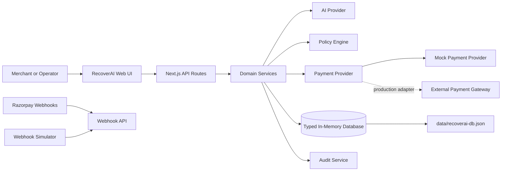
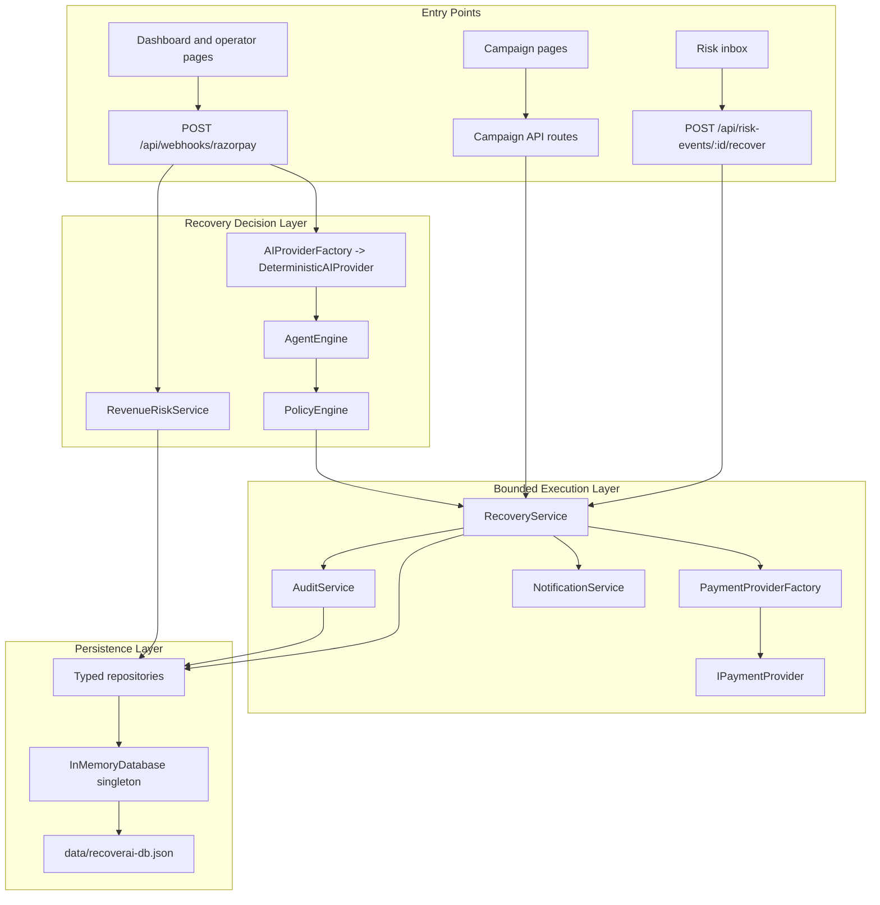
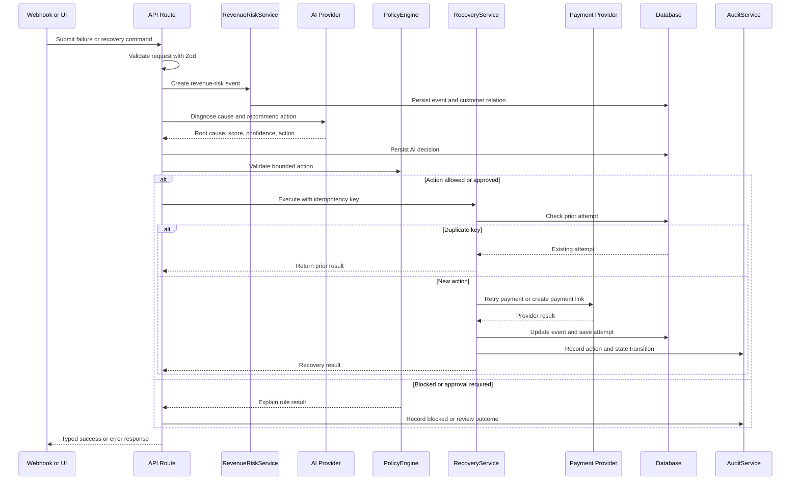
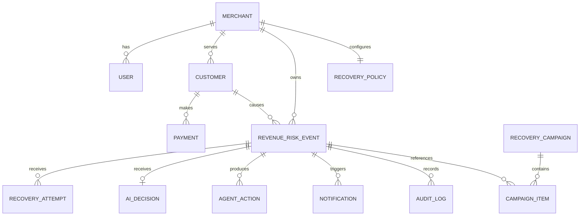
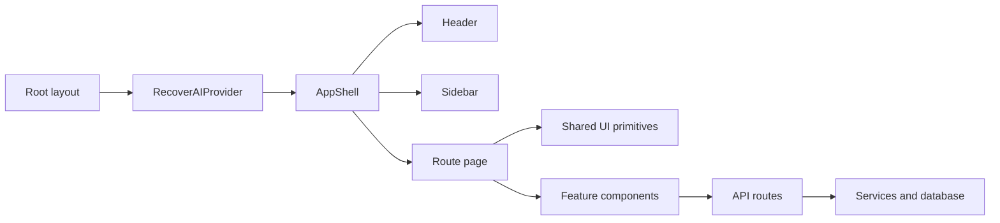
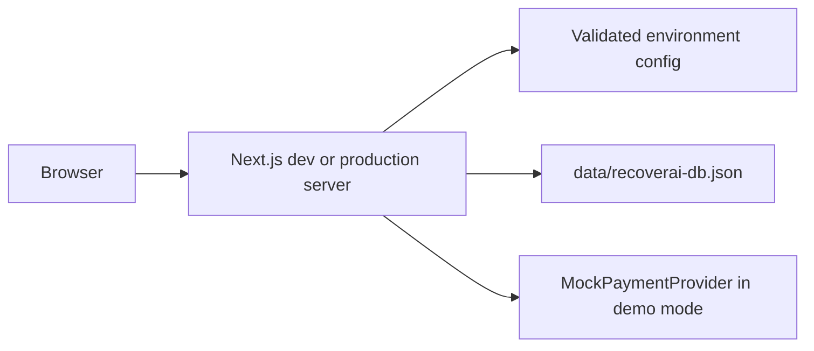

# RecoverAI Architecture

RecoverAI is a Next.js application that detects revenue risk, diagnoses the likely cause, selects a bounded recovery action, validates merchant policy, executes through a payment-provider abstraction, and records the result for measurement and audit.

## 1. System Context



The application is currently a local/demo-first system. `MockPaymentProvider` is selected in demo mode, while the provider factory keeps the payment boundary replaceable for a real gateway integration.

## 2. Runtime Architecture



## 3. Core Recovery Workflow



### Workflow stages

1. **Detect**: Accept a payment failure, checkout abandonment, subscription failure, overdue invoice, or operator action.
2. **Normalize**: Validate the request and convert the source event into a `RevenueRiskEvent`.
3. **Diagnose**: The AI provider returns structured root-cause data, confidence, recovery probability, signals, and a recommended intervention.
4. **Enforce policy**: Check opt-out status, retry/reminder limits, amount thresholds, confidence thresholds, quiet hours, and already-recovered state.
5. **Approve when required**: High-value or low-confidence actions remain under merchant control.
6. **Execute**: `RecoveryService` dispatches only supported actions through `IPaymentProvider` and uses an idempotency key.
7. **Measure**: Mark money as recovered only after a provider success result. Predictions remain separate from confirmed settlements.
8. **Stop safely**: Stop after success, opt-out, maximum attempts, or manual-review escalation.
9. **Audit**: Record actors, action, reason, policy result, idempotency key, amount, and state information.

## 4. Module Ownership

| Area | Location | Responsibility |
| --- | --- | --- |
| Application shell | `src/app/layout.tsx`, `src/components/layout/` | Global metadata, provider setup, navigation, and shared shell |
| Operator UI | `src/app/`, `src/components/` | Dashboard, risk inbox, campaigns, policies, analytics, audit, settings, and copilot views |
| API boundary | `src/app/api/` | HTTP routes, request schemas, route parameters, and response mapping |
| Risk ingestion | `src/services/revenueRisk.service.ts` | Create and manage revenue-risk events |
| AI decisioning | `src/services/providers/`, `src/lib/agentEngine.ts` | Provider abstraction plus deterministic diagnosis and scoring |
| Policy enforcement | `src/lib/policyEngine.ts` | Safety rules, approval gates, limits, and stopping rules |
| Recovery execution | `src/services/recovery.service.ts` | Idempotency, opt-out blocking, provider dispatch, state updates, and attempts |
| Campaign execution | `src/services/campaign.service.ts` | Batch triage and recovery campaign progress |
| Payment integration | `src/services/providers/paymentProvider*`, `src/lib/providers/` | Payment-provider interface, factory, and mock implementation |
| Audit and notifications | `src/services/audit.service.ts`, `src/services/notification.service.ts` | Traceability and operator/customer notifications |
| Persistence | `src/db/` | Database singleton, repositories, schema, and seed data |
| Shared contracts | `src/types/` | Domain, database, API, policy, AI, and provider types |
| Client state | `src/lib/store.tsx` | React context and client-side application state |
| Configuration | `src/config/env.ts`, `.env.local` | Environment validation and runtime settings |

## 5. Data Model

The typed database stores these logical aggregates:



The current `InMemoryDatabase` uses typed `Map` collections and an audit-log array. It loads and persists a JSON snapshot at `data/recoverai-db.json`; this is suitable for local development and demos, not concurrent production workloads.

### Important invariants

- `recoveredAmount` is non-zero only for a confirmed successful provider action.
- `recoveryProbability` is a prediction and must not be reported as recovered revenue.
- A recovery attempt is uniquely identified by its idempotency key.
- A recovered event must not receive another automated recovery action.
- An opted-out customer must not receive a recovery contact or payment action.
- A high-value or below-threshold action can require merchant approval before execution.
- Every execution or block should have an audit record.

## 6. API Surface

| Route group | Purpose |
| --- | --- |
| `/api/webhooks/razorpay` | Ingest Razorpay-shaped events and simulator payloads; create risk events and optionally auto-execute eligible actions |
| `/api/risk-events` | List and inspect revenue-risk events |
| `/api/risk-events/:id/recover` | Execute a selected recovery intervention with an idempotency key through `RecoveryService` |
| `/api/risk-events/:id/stop` | Stop an event workflow |
| `/api/campaigns` | Create and inspect batch recovery campaigns |
| `/api/campaigns/:id/approve` | Approve a campaign or gated action |
| `/api/payments` | Read payment data used by dashboard workflows |
| `/api/policies` | Read and update merchant recovery policy |
| `/api/audit` | Read the audit trail |

All request bodies that accept user or webhook input are validated at the API boundary with Zod. Route handlers use shared response and error helpers from `src/lib/api/`.

## 7. Safety and Reliability Boundaries

### Policy boundary

`PolicyEngine.validateAction` runs before an action is treated as eligible. It blocks recovered events, customer opt-outs, and exhausted retry/reminder limits. It can require approval when the amount or confidence exceeds configured automation boundaries.

### Provider boundary

Business logic calls `IPaymentProvider` through `PaymentProviderFactory`. The application therefore does not couple recovery rules to a specific gateway API. The local mock returns deterministic results for repeatable demonstrations and tests.

### Idempotency boundary

Every recovery execution receives an idempotency key. `RecoveryService` checks for an existing attempt before dispatching to the provider, preventing duplicate action for a repeated request.

### Audit boundary

`AuditService` records recovery success, failure, blocked actions, workflow stops, webhook handling, and policy outcomes. Audit data is intended to explain who or what acted, why it acted, and what changed.

## 8. Frontend Composition



The UI is organized around operator workflows rather than a separate frontend server. Pages use the shared `AppShell`, while reusable primitives such as `Button`, `Card`, `Badge`, `Modal`, `ProgressBar`, and `Skeleton` keep interaction and loading states consistent.

## 9. Local Runtime and Configuration



Required local setup:

```text
Node.js 20+
npm install
Copy-Item .env.example .env.local
npm run dev
```

Relevant configuration includes `DEMO_MODE`, `NODE_ENV`, `PORT`, optional `DATABASE_URL`, optional Razorpay credentials, and `NEXT_PUBLIC_APP_NAME`. Keep `.env.local` private.

## 10. Test Architecture

| Test area | Location | What it protects |
| --- | --- | --- |
| API validation | `tests/api/validation.test.ts` | Request schemas and malformed input behavior |
| Webhooks | `tests/api/webhook.test.ts` | Event ingestion and workflow dispatch |
| Repositories | `tests/db/repositories.test.ts` | Persistence and query behavior |
| Providers | `tests/providers/` | Payment-provider contract and mock outcomes |
| Services | `tests/services/` | Recovery, policy, audit, campaign, and payment behavior |
| Seed data | `tests/seed/` | Deterministic demo data generation |
| End-to-end workflow | `tests/e2e/heroRecoveryFlow.test.ts` | Detection through confirmed recovery and audit |

Validation commands:

```bash
npm run typecheck
npm run lint
npm test
npm run build
```

## 11. Production Evolution

The current architecture deliberately keeps demo dependencies replaceable. A production deployment should preserve the domain contracts while replacing infrastructure seams:

1. Replace JSON persistence with a transactional database and repository implementations.
2. Make idempotency atomic at the database/provider boundary so multiple server instances cannot race.
3. Verify webhook signatures, apply replay protection, and process events through a durable queue.
4. Move long-running campaigns and retries to background workers with scheduled execution.
5. Add authentication, authorization, tenant isolation, rate limiting, and encrypted secrets.
6. Replace or augment the deterministic AI provider with a versioned provider that stores prompts, model metadata, and decision evidence.
7. Make audit storage append-only and independently retained for compliance.
8. Add observability for webhook latency, policy blocks, provider failures, recovery conversion, and confirmed recovered revenue.

The domain flow should remain stable: detect, diagnose, constrain, approve when necessary, execute idempotently, measure confirmed settlement, stop safely, and audit.
